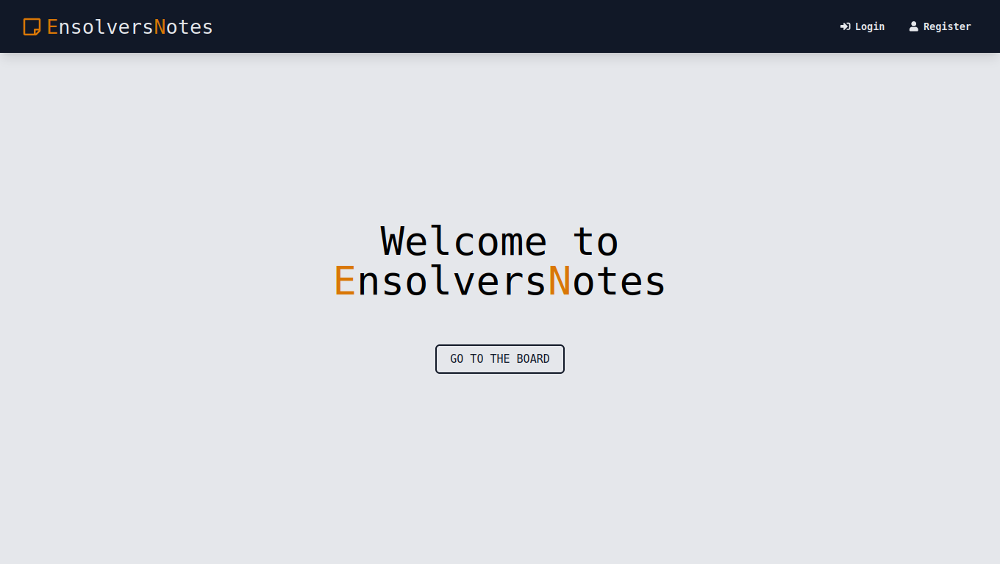
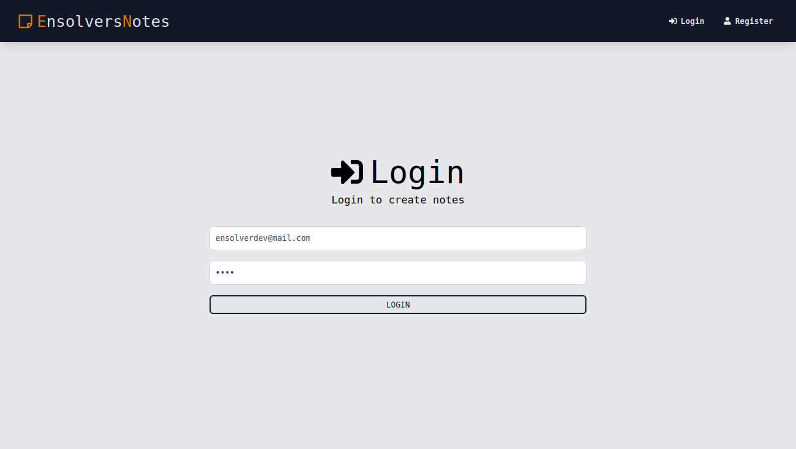
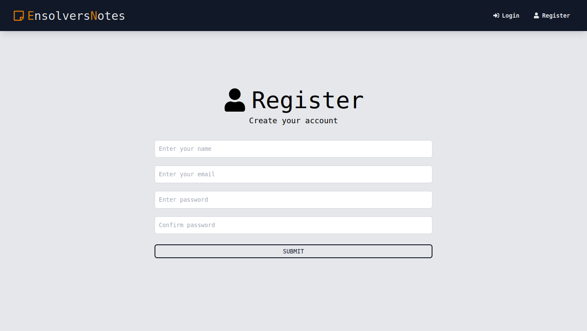
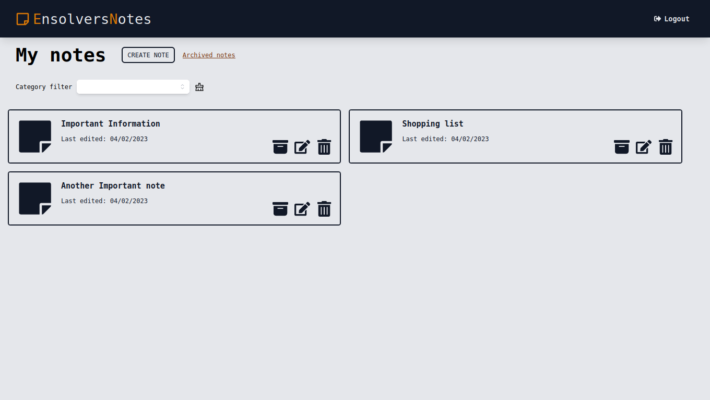
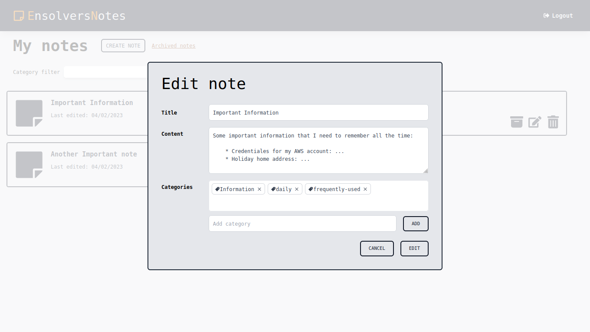
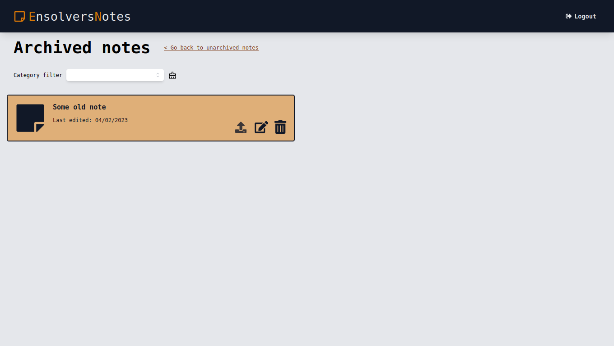
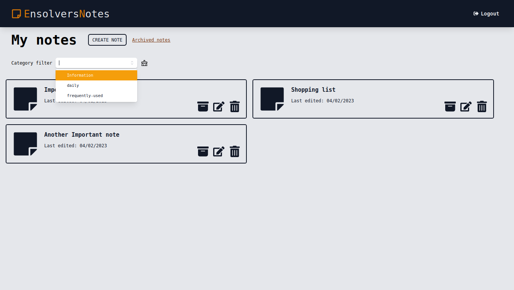

<h1 align="center">
Ensolvers Notes 📝
</h1>
<p align="center">
Built with MERN stack
</p>

> MERN is a fullstack implementation in MongoDB, Expressjs, React/Redux, Nodejs.

## Clone or Download
```terminal
$ git clone https://github.com/camilapensolvers/GitHubJLin-99-Ensolvers-Challenge.git
```

## Project structure
```terminal
  run-app.sh
  server/
    package.json
    .env (needs to be created)
  client/
    package.json
```

# Run the fullstack app on you machine

## Prerequisites
- [Node.js](https://nodejs.org/en/)
- [npm](https://www.npmjs.com/)
- [MongoDB](https://www.mongodb.com/en)

> You need client & server runs concurrently in order to make them talk to each other.

## Run the app with just running one command.
```terminal
chmod +x run-app.sh     # First, make the script executable
./run-app.sh            # Second, run the script
```

### Inside de bash script
```terminal
#!/bin/bash
echo "Running Ensolvers Notes MERN stack app..."

cd frontend       # Go to frontend folder
npm install       # Install frontend dependencies
cd ../backend     # Go to backend folder
npm install       # Install backend dependencies
npm run dev       # Start both concurrently
```

# Dependencies (tech-stacks)
Client-side | Server-side
--- | ---
axios: ^1.3.1 | bcryptjs: ^2.4.3
react: ^18.2.0 | cors: ^2.8.5
react-dom: ^18.2.0 | date-fns: ^2.29.3
react-icons: ^4.7.1 | dotenv: ^16.0.3
react-modal: ^3.16.1 | express: ^4.18.2
react-redux: ^8.0.5 | express-async-handler: ^1.2.0
react-router-dom: ^6.8.0 | jsonwebtoken: ^9.0.0
react-scripts: 5.0.1 | mongoose: ^6.9.0
react-toastify: ^9.1.1 | uuid: ^9.0.0
redux: ^4.2.1 | 
@fvilers/disable-react-devtools: ^1.3.0 | 
@headlessui/react: ^1.7.9 | 
@reduxjs/toolkit: ^1.9.2 | 

# Screenshots

> Home page


> User can log in or register
<p align="center">


</p>

> User can create, edit and delete notes

<p align="center">
  
  
  
<p>

> User can archive/unarchive notes


> User can filter notes by category



# Author
[JLin-99](https://github.com/JLin-99)

Email Me: lin-jose@outlook.com